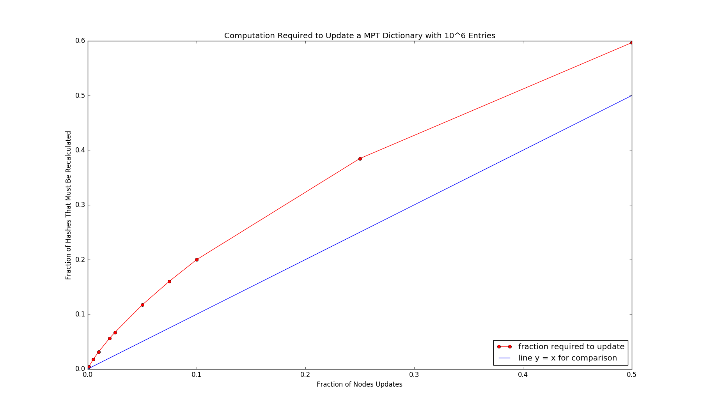

# A Java Implementation of Authenticated Dictionaries and Authenticated Sets Using Merkle Prefix Tries (MPT) 

This is a full implementation of <b>Authenticated Dictionaries</b> (<i>a set of key-value mappings</i>) and <b>Authenticated Sets</b> (<i>a set of values</i>) using Merkle Prefix Tries. This data structure allows very small (logarithmic) proofs of membership and non-membership. These data structures also support updates for use in a dynamic setting. These updates are very small because the implementation exploits client caching to avoid retransmitting unchanged internal values. Recalculation of hashes can be done in parallel to speed up updates.

# Usage

### Build
`$sh build.sh`

### Install
`$mvn install`

### Test
`$mvn test`

# Benchmarks
We benchmark using a dictionary with 

`10^6 key, value pairs`

This dictionary has 

`TOTAL NODES: 2885977`

and of the breakdown of the type of these nodes is:

`INTERIOR NODES: 1442988 (49.9999826748 %)`

`EMPTY LEAF NODES: 442989 (15.3497065292 %)`

`NONEMPTY LEAF NODES: 1000000 (34.650310796 %)`

## Work Required During Updates

As entries are inserted, removed or updated, the hashes in the tree change. The work required to recalculate the updates depends on the fraction of nodes updated. Here is a plot of the fraction of hashes that must be re-calculated after mappings in the dictionary are updated. The current implementation can perform these hash updates in parallel if desired.

 

## Size of Proofs

Here is how the size of a proof changes after updates are applied. Note that if there are relatively few updates client caching can reduce the size of the proofs by over 50%

 

You can reproduce all these benchmarks using

`$./benchmark.sh`

and using the script 

`python3 data_vis.py`

# Serialization 
Serialization: the individual messages have an overhead of 2-6 bytes.
Stub - 36 bytes (32 byte hash + 4 byte overhead)
Leaf - k+v+6 bytes (key size + value size + 6 byte overhead)
InteriorNode  - 2 byte overhead 
