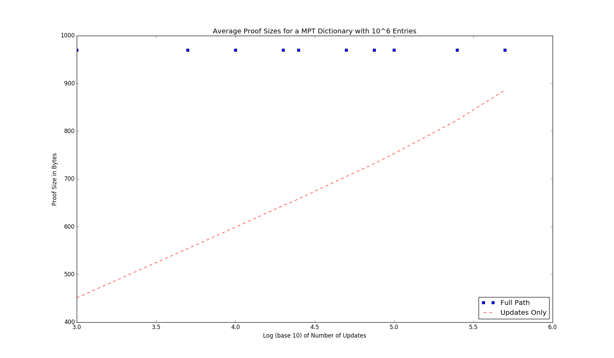

# A Java Implementation of Authenticated Dictionaries and Authenticated Sets Using Merkle Prefix Tries (MPT) 

This is a full implementation of <b>Authenticated Dictionaries</b> (<i>a set of key-value mappings</i>) and <b>Authenticated Sets</b> (<i>a set of values</i>) using Merkle Prefix Tries. This datastructure allows very small lograthmic proofs of membership and non-membership. These data structures also support updates for use in a dynamic setting. These updates are very small because the implementation exploits client caching to avoid retransmitting unchanged internal values.

# Usage

### Build
`$sh build.sh`

### Install
`$mvn install`

### Test
`$mvn test`

# Benchmarks
We benchmark using a dictionary with 

`10^6 key, value pairs`

Here are the results:

 

You can reproduce these benchmarks using

`$./benchmark.sh`

# Serialization 
Serialization: the individual messages have an overhead of 2-6 bytes.
Stub - 36 bytes (32 byte hash + 4 byte overhead)
Leaf - k+v+6 bytes (key size + value size + 6 byte overhead)
InteriorNode  - 2 byte overhead 
